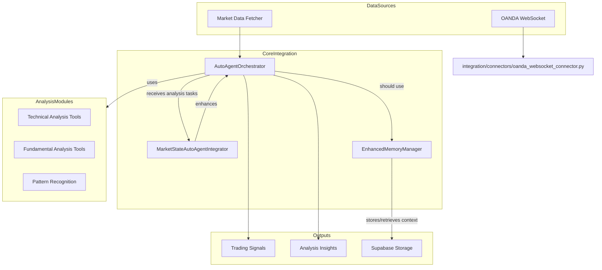

# AutoAgent Integration for AI Forex

This module provides integration between AutoAgent and the AI Forex trading system, enabling context-aware market analysis and cross-analysis coordination.

## Overview

The AutoAgent integration enhances the AI Forex system with:

- Advanced context management for analysis history
- Real-time market state detection and adaptive analysis
- Coordination of multiple analysis modules
- WebSocket connectors for live data feeds
- Structured insights generation and persistent storage

## Architecture

The integration architecture centers around the `AutoAgentOrchestrator`, which is enhanced by other components to provide a comprehensive analysis pipeline.



**Note:** The `EnhancedMemoryManager` is not yet fully integrated with the `AutoAgentOrchestrator`.

## Key Components

1.  **AutoAgentOrchestrator (`autoagent_orchestrator.py`)**
    -   Coordinates multiple analysis modules (technical, fundamental, patterns).
    -   Manages the flow of information between components.
    -   Implements the core analysis pipeline.
    -   Currently uses a simple in-memory dictionary for context management.

2.  **MarketStateAutoAgentIntegrator (`market_state_autoagent_integration.py`)**
    -   Enhances the `AutoAgentOrchestrator` with market state awareness using monkey-patching.
    -   Integrates with the `MarketStateAnalyzer` from the `features` module to detect market regimes (e.g., trend, consolidation).
    -   Allows for adaptive analysis based on the detected market state.

3.  **EnhancedMemoryManager (`enhanced_memory_manager.py`)**
    -   Provides a sophisticated memory system for storing and retrieving analysis context.
    -   Uses an `AnalysisContext` data model to structure analysis results.
    -   Integrates with `Supabase` via `services/supabase_memory_service.py` for persistent storage.
    -   Features an in-memory cache for frequently accessed data.
    -   **Note:** This component needs to be integrated into the `AutoAgentOrchestrator` to replace the current in-memory context management.

4.  **Connectors (`integration/connectors`)**
    -   Contains connectors for live data streaming.
    -   `oanda_websocket_connector.py` provides a connection to OANDA's real-time data feed.

## Recent Enhancements

### Market State Integration

The `market_state_autoagent_integration.py` file enhances the `AutoAgentOrchestrator` by dynamically adding market state detection capabilities. This is achieved by "monkey-patching" the orchestrator's `analyze_market` method at runtime, allowing the system to adapt its analysis based on real-time market conditions.

### Database Integration

All database operations are designed to consistently use Supabase through `forex_ai.data.db_connector`. The `enhanced_memory_manager.py` leverages `services/supabase_memory_service.py` to provide a robust, persistent memory layer for analysis context.

### Import Structure

Recent updates have addressed import issues across the integration module, ensuring that all components use consistent and correct module paths.

## Usage Example

```python
from forex_ai.data import MarketDataFetcher
from forex_ai.integration.autoagent_orchestrator import AutoAgentOrchestrator
from forex_ai.integration.market_state_autoagent_integration import MarketStateAutoAgentIntegrator
from forex_ai.config import AnalysisConfig

# 1. Initialize data fetcher
data_fetcher = MarketDataFetcher(
    api_key="your_api_key",
    provider="oanda"
)

# 2. Configure analysis parameters
config = AnalysisConfig(
    timeframes=["H1", "H4", "D1"],
    indicators=["RSI", "MACD", "Bollinger"],
    lookback_periods=100
)

# 3. Initialize the orchestrator
orchestrator = AutoAgentOrchestrator({
    "config": config,
    "data_fetcher": data_fetcher
})

# 4. Enhance the orchestrator with Market State detection
state_integrator = MarketStateAutoAgentIntegrator(orchestrator)

# 5. Analyze the market
# The orchestrator's analyze_market method is now enhanced
results = orchestrator.analyze_market("EUR_USD")

# 6. Print insights and signals
for insight in results.get("insights", []):
    print(f"{insight['timeframe']} | {insight['indicator']}: {insight['message']}")

signals = results.get("signals", [])
if signals:
    for signal in signals:
        print(f"Signal: {signal['direction']} {signal['pair']} at {signal['price']}")
else:
    print("No trading signals generated.")

# 7. Check the detected market state
market_view = results.get("market_view", {})
if "market_state" in market_view:
    market_state = market_view["market_state"]
    print(f"Detected market state: {market_state.get('state_type')}")
    print(f"State confidence: {market_state.get('confidence')}")

```

## Future Work: Integrating EnhancedMemoryManager

To enable persistent context across analysis runs, the `EnhancedMemoryManager` needs to be integrated with the `AutoAgentOrchestrator`.

```python
# Example of how EnhancedMemoryManager could be used (integration needed)
from forex_ai.integration.enhanced_memory_manager import EnhancedMemoryManager

# Initialize the memory manager
memory_manager = EnhancedMemoryManager()

# The orchestrator needs to be modified to use the memory manager
# for storing and retrieving context.

# Fictional future usage:
# orchestrator.set_memory_manager(memory_manager)

# First analysis - context is stored
# initial_results = orchestrator.analyze_market("EUR_USD")

# Later analysis - orchestrator retrieves and uses previous context
# updated_results = orchestrator.analyze_market("EUR_USD")

```

## Running Tests

The `examples` directory contains scripts to test different parts of the integration module.

```bash
# Run standalone test with simulated data
python -m forex_ai.examples.autoagent_workflow_test

# Run live test with real market data
python -m forex_ai.examples.autoagent_live_test_standalone
```