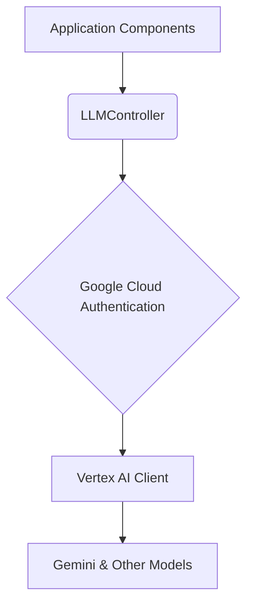

# LLM Models

This module integrates with Google Vertex AI to provide access to powerful generative models like Gemini.

## Overview

The `llm_controller.py` is the central component of this module. It is responsible for:

- **Initializing the Google Vertex AI Client**: It uses Application Default Credentials (ADC) to securely connect to the Google Cloud project.
- **Providing Access to Models**: It offers a simple interface to get a pre-configured client for making LLM calls.
- **Listing Available Models**: It provides a list of available and configured Vertex AI models (e.g., `gemini-1.0-pro`).

## Architecture

The architecture is centered around the `LLMController`, which acts as a singleton to provide a shared, pre-configured Vertex AI client to the rest of the application.



## Key Components

1.  **`LLMController`**:
    -   Manages the lifecycle of the Vertex AI client.
    -   Configured via `LLMSettings`.
    -   Provides a `get_client()` method to access the `aiplatform` object.

2.  **Configuration (`config/settings.py`)**:
    -   `GCP_PROJECT_ID`: Your Google Cloud project ID.
    -   `GCP_LOCATION`: The Google Cloud region for your Vertex AI resources (e.g., `us-central1`).

## Usage

To use the `LLMController`, you simply import it and call its methods.

```python
from forex_ai.models.llm_controller import LLMController

# Initialize the controller
llm_controller = LLMController()

# Get the Vertex AI client
vertex_ai_client = llm_controller.get_client()

if vertex_ai_client:
    # Now you can use the client to interact with Vertex AI models
    # For example, to load a generative model:
    from vertex_ai.generative_models import GenerativeModel

    model = GenerativeModel("gemini-1.0-pro")
    response = model.generate_content("What is the future of forex trading?")
    print(response.text)

# Check the status of the client
status = llm_controller.get_status()
print(f"Vertex AI client connected: {status.get('vertex_ai')}")
```

## Authentication

This module relies on **Application Default Credentials (ADC)**. Before running the application, ensure you have authenticated your environment with Google Cloud by running:

```bash
gcloud auth application-default login
```

This command will store credentials on your local machine that the client library can automatically detect and use. 